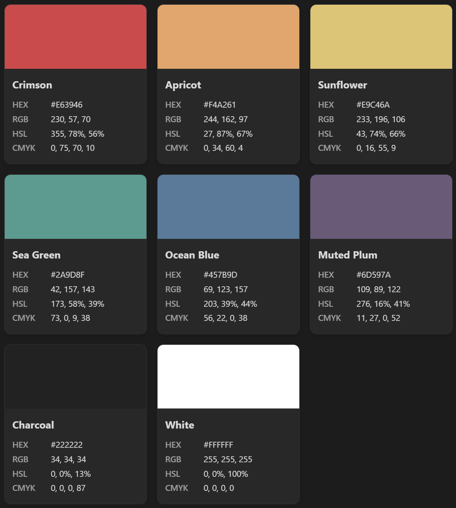
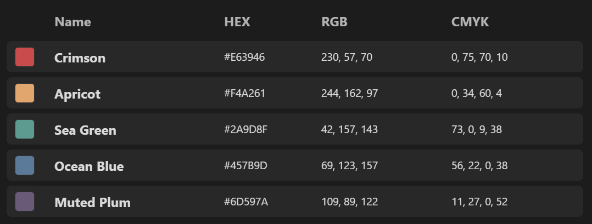
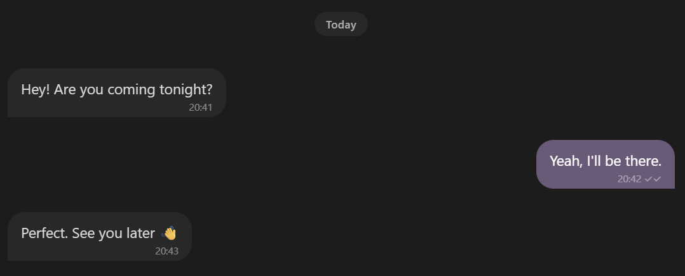

# Obsidian UI Lab

Reusable Markdown layouts and CSS components for making Obsidian more visual.

Obsidian UI Lab is a growing collection of small, copy-friendly UI components for Obsidian. Each component includes a working example, the required CSS, and simple customization guidance.

---

## Current Components

### 🎨 Color Swatch Cards

A responsive card grid for displaying color palettes and reference values inside Obsidian.




**Features**

- Responsive grid layout
- Clean card design
- Supports custom colors and CSS variables
- Works with native HTML inside Obsidian notes
- Light and dark theme friendly
- No third-party plugins required

**Files**

```
01 - Color UI/
└── Color Swatch Cards.md

.obsidian/
└── snippets/
    ├── custom-colors.css
    └── color-swatch-cards.css
```


### 📋 Color Reference Table

A compact reference table for displaying color swatches and related values.

The underlying table styles are intentionally generic, so the component can also be adapted for design tokens, project references, status lists, inventories, or other structured data.




**Features**

- Compact reference layout
- Visual swatch column
- Flexible name column
- Hover states
- Customizable columns
- Reusable beyond color palettes
- No third-party plugins required

**Files**

```text
01 - Color UI/
└── Color Reference Table.md

.obsidian/
└── snippets/
    └── reference-table.css
```

`custom-colors.css` can optionally be used with this component, but is not required.


### 💬 Basic Chat Bubbles

Create simple chat-style conversations using native Obsidian callouts.




**Features**

- Left and right message bubbles
- Message tails
- Timestamps
- Read receipts
- Date separators
- Responsive message width
- Scrollbar fixes for Obsidian callouts
- No third-party plugins required

**Files**

```text
02 - Chat UI/
└── Basic Chat Bubbles.md

.obsidian/
└── snippets/
    └── chat-core.css
```

`custom-colors.css` can optionally provide the shared Obsidian UI Lab accent color.

The chat system will be expanded gradually with replies, images, galleries, and reactions.

---

## Shared Theme

The project includes a reusable color system in:

```
.obsidian/snippets/custom-colors.css
```

It provides shared color variables and utility classes that can be reused across future components such as cards, chat interfaces, dashboards, trackers, and other UI elements.

Examples:

```
color: var(--ui-purple);
background: var(--ui-soft-purple);
```

You can use the provided palette or replace it with your own colors.

---

## Installation

You can either:

- Clone or download the entire vault
- Copy individual components into an existing Obsidian vault

Full setup instructions are available in:

```
00 - Start Here/How to Install.md
```

---

## Project Structure

```text
obsidian-ui-lab/
│
├── README.md
├── .gitignore
│
├── assets/
│   └── screenshots/
│       ├── color-swatch-cards.png
│       ├── color-reference-table.png
│       └── basic-chat-bubbles.png
│
├── 00 - Start Here/
│   ├── How to Install.md
│   ├── CSS Snippets.md
│   └── Custom Colors.md
│
├── 01 - Color UI/
│   ├── Color Swatch Cards.md
│   └── Color Reference Table.md
│
├── 02 - Chat UI/
│   └── Basic Chat Bubbles.md
│
└── .obsidian/
    └── snippets/
        ├── custom-colors.css
        ├── color-swatch-cards.css
        ├── reference-table.css
        └── chat-core.css
```

The project is intentionally starting small and will grow component by component.

---

## Planned Components

### Chat UI

- Reply messages
- Image messages
- Image galleries
- Message reactions
- Complete chat examples

### Other UI

- Cards
- Journaling layouts
- Trackers
- Dashboards
- Navigation elements
- Image layouts
- Creative writing UI
- Interface-inspired components

---

## Philosophy

The goal is to keep each component:

- Easy to understand
- Easy to copy
- Easy to customize
- Independent where possible
- Consistent with the rest of the vault

No giant theme required.

Use only the pieces you want.

---

More components coming soon.